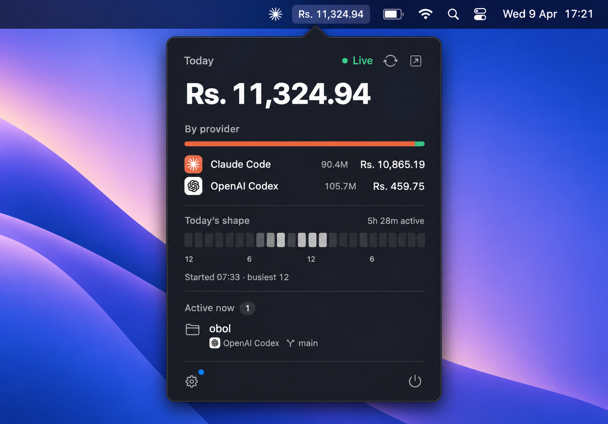
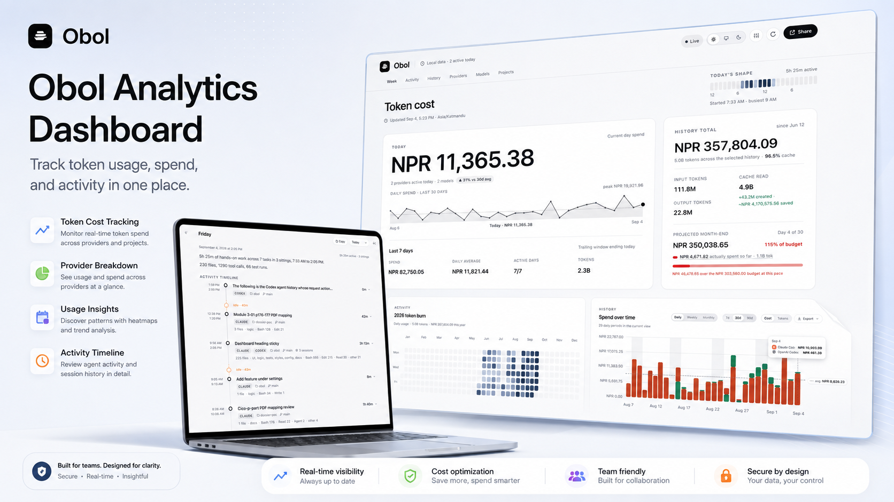

<div align="center">

# Obol

**See what your AI coding agents cost — right from your menu bar.**

Obol is a local-first macOS app for tracking token usage and estimated spend
from Claude Code, Codex CLI, and OpenCode.

No account. No API key. No usage data uploads.

[](https://github.com/aakritsubedi/obol/releases/latest/download/Obol.dmg)

[All releases](https://github.com/aakritsubedi/obol/releases) · [Report an issue](https://github.com/aakritsubedi/obol/issues) · [Build from source](#build-from-source)

[](https://github.com/aakritsubedi/obol/actions/workflows/ci.yml)
[](LICENSE)



</div>

## Why Obol

AI coding tools make it easy to lose track of usage across projects and
providers. Obol keeps the answer close at hand while keeping the underlying
usage data on your Mac.

- **Menu bar overview** — see today’s total, provider split, token counts, and
  live or cached status in one click.
- **Local dashboard** — explore daily, weekly, and monthly history; provider
  and model breakdowns; activity intensity; and week-to-date leaders.
- **Work journal** — review agent sessions, prompts, projects, branches, tools,
  edited files, active minutes, and currently active work.
- **Budgets and alerts** — set daily and monthly budgets, choose a warning
  threshold, and receive native notifications when usage crosses it.
- **Sharing and export** — export the current history view as CSV or JSON, or
  create a shareable usage image from the dashboard.
- **Display currencies** — show amounts in a supported currency while keeping
  stored costs and budgets in USD.
- **Mac controls** — launch at login and optionally keep the Mac awake while
  an agent session is active, including with the lid closed when configured.
- **Quiet updates** — check GitHub Releases in the background and verify the
  update before installing it.

<div align="center">



</div>

## Install

1. Download [`Obol.dmg`](https://github.com/aakritsubedi/obol/releases/latest/download/Obol.dmg), or choose a version from [Releases](https://github.com/aakritsubedi/obol/releases).
2. Open the DMG and drag **Obol** to **Applications**.
3. Launch Obol. On the first launch after downloading, right-click the app,
   choose **Open**, and confirm the macOS prompt.

The public build is ad-hoc signed rather than notarized. The one-time
right-click → **Open** step is expected for this open-source project; it is not
an Obol permission request.

### Requirements

- macOS 13 or later
- Apple silicon or Intel Mac

Downloaded releases include a universal Node.js runtime, so end users do not
need Node.js, npm, or a shell configuration. Node.js 20 or later is required
only for development and source builds.

## Supported agents

Obol reads local records from the agents below. Missing or unused sources are
ignored, so installing one agent is enough to get started.

| Agent | Local source | What Obol can show |
| --- | --- | --- |
| Claude Code | `~/.claude/projects` | Provider totals, project history, session activity, and estimated session shares |
| Codex CLI | `~/.codex/sessions` | Provider totals, session activity, prompts, tools, edited files, and active work |
| OpenCode | `~/.local/share/opencode/opencode.db` | Provider totals, session activity, prompts, tools, edited files, and active work |

Provider totals and history come from [ccusage](https://github.com/ryoppippi/ccusage)
using its offline report. Project-level cost history is currently Claude-only;
Codex and OpenCode still contribute to aggregate provider and daily totals.

## Accuracy and privacy

Obol shows estimates from ccusage’s pricing table, not provider invoices. A
session’s cost is not a billing record: ccusage reports daily cost by Claude
project, so Obol apportions that project total across Claude sessions by output
tokens. Codex and OpenCode session records do not include a comparable
per-project cost source.

Usage processing is local:

- The daemon reads agent logs or databases from your home directory.
- ccusage runs with `--offline` and the daemon listens on `127.0.0.1` only.
- Configuration and the last good snapshot stay in `~/.obol`.
- Obol does not upload agent logs, prompts, usage snapshots, or API keys.

The app can still make two kinds of optional network requests: GitHub Release
checks for the updater and the public Frankfurter API when you select a
non-USD display currency. Neither request receives your usage data.

### Local state

| File | Purpose |
| --- | --- |
| `~/.obol/config.json` | Budgets, refresh settings, display currency, and other preferences |
| `~/.obol/snapshot.json` | Last successful usage snapshot used while a refresh is unavailable |
| `~/.obol/runtime.json` | The running daemon’s loopback port and short-lived access token |
| `~/.obol/daemon.log` | Daemon startup and runtime diagnostics |

## How it works

```text
  macOS menu-bar app ─────┐
                           │ loopback HTTP + per-process token
  local dashboard ────────┤
                           ▼
                    Node daemon
                      ├── ccusage --offline
                      ├── Claude / Codex / OpenCode adapters
                      └── ~/.obol snapshot and configuration
```

The daemon is the source of truth for both the native popover and the
dashboard. It watches supported agent data, refreshes usage on a configurable
interval, keeps the last good snapshot, and serves the dashboard from the
same loopback-only process.

## Troubleshooting

### The dashboard is empty or stale

Open an agent session, click **Refresh** in the popover or dashboard, and check
that the agent has written data to its local source path in the table above.
Obol keeps showing the last good snapshot when a refresh fails; the reason is
shown as a daemon notice in the dashboard.

### The daemon is unavailable

Check `~/.obol/daemon.log`. For a downloaded release, Node is bundled with the
app. For a development build, install Node.js 20 or later, then build the
daemon and dashboard before launching the native app:

```sh
npm ci
npm run build
```

### macOS blocks the first launch

Right-click **Obol.app**, choose **Open**, and confirm. This is expected for
the ad-hoc signed public build. A Developer ID-signed release does not need
this step.

### A project or session is missing

Obol only counts records with timestamps that fall in the selected local day.
It also ignores subagent transcripts that replay work already attributed to a
parent session. Project cost history is available for Claude because Claude’s
project records can be joined to ccusage’s project report; other agents still
appear in aggregate usage and the work journal.

## Build from source

Source builds require macOS, Node.js 20 or later, npm 10, and Xcode 16 or
later. Install dependencies and build the JavaScript workspaces first:

```sh
npm ci
npm run build
```

To build a distributable universal app and installer artifacts:

```sh
npm run package:dmg
```

This writes the following to `dist/`:

- `Obol-VERSION.dmg` — drag-to-Applications installer
- `Obol-VERSION.zip` — artifact used by the in-app updater
- `SHA256SUMS` — SHA-256 checksums for the DMG and ZIP

Packaging vendors a universal Node runtime into the app. It may download the
pinned runtime on the first package build. The public artifact is ad-hoc
signed by default; signing and notarization details are in
[`macos/README.md`](macos/README.md).

### Development

Start the daemon first so the dashboard can read its runtime token, then start
Vite in a second terminal:

```sh
# terminal 1
npm run dev:daemon

# terminal 2
npm run dev:dashboard
```

Other useful commands:

```sh
npm run once -w daemon       # one refresh and a JSON summary
npm run typecheck            # TypeScript checks
npm test                     # JavaScript tests
npm run lint                 # Biome checks
node scripts/check-boundaries.mjs
npm run check-contract-fixtures
swift test --package-path macos
```

For native app builds, open [`macos/Obol.xcodeproj`](macos/Obol.xcodeproj)
after `npm run build`. More details about universal builds, version stamping,
packaging, and signing live in [`macos/README.md`](macos/README.md).

An Xcode Debug build uses Node from the host Mac rather than the packaged
runtime. The app checks common Homebrew, MacPorts, system, Volta, nvm, mise,
and fnm locations. Finder-launched apps do not inherit your shell’s `PATH`, so
if a Debug build cannot start the daemon, install Node 20+ in one of those
locations and inspect `~/.obol/daemon.log`.

## Releases and contributing

Merging to `main` triggers the release workflow. Commit subjects determine the
semantic-version bump, and GitHub Actions builds the universal DMG, updater
ZIP, and checksums. See [`docs/updater.md`](docs/updater.md) for the local
update fixture and trust model.

Pull requests are welcome. Start with [`CONTRIBUTING.md`](CONTRIBUTING.md) for
the required checks and commit conventions, and use [`SECURITY.md`](SECURITY.md)
for the local boundary and updater security model.

## License

Obol is available under the [MIT License](LICENSE). It uses and credits
[ccusage](https://github.com/ryoppippi/ccusage) for offline usage estimation.
